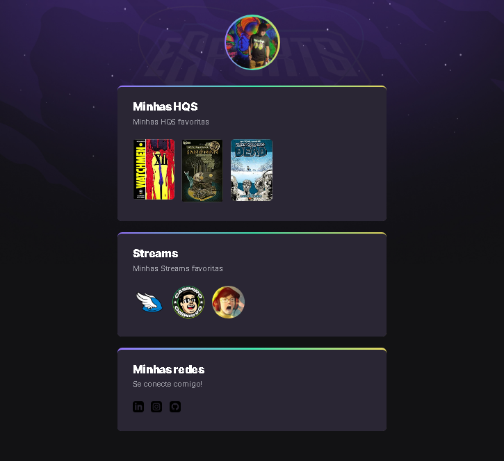

> # NLW ESPORT 

> Trilha explorer

Projeto construiído do evento Next Level Week da Rockseat.
Aula teórica e prática de como funciona o HTML, sobre TAGS e Elementos.
Aplicação no CSS e epxlicação de alguns estilos e animações.

# Tecnologia

- HTML
- CSS
- GIT E GITHUB

[Clique aqui para acessar o site](https://https://luiizhcoelho.github.io/NLW-eSport-Explorer/)

# Contado

> LH07045@gmail.com

> https://www.linkedin.com/in/luiz-henrique-santos-7187831b7/